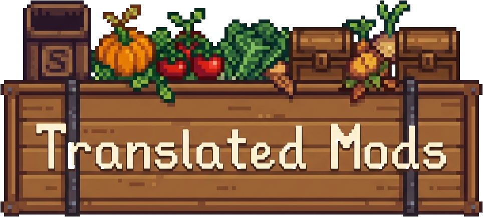
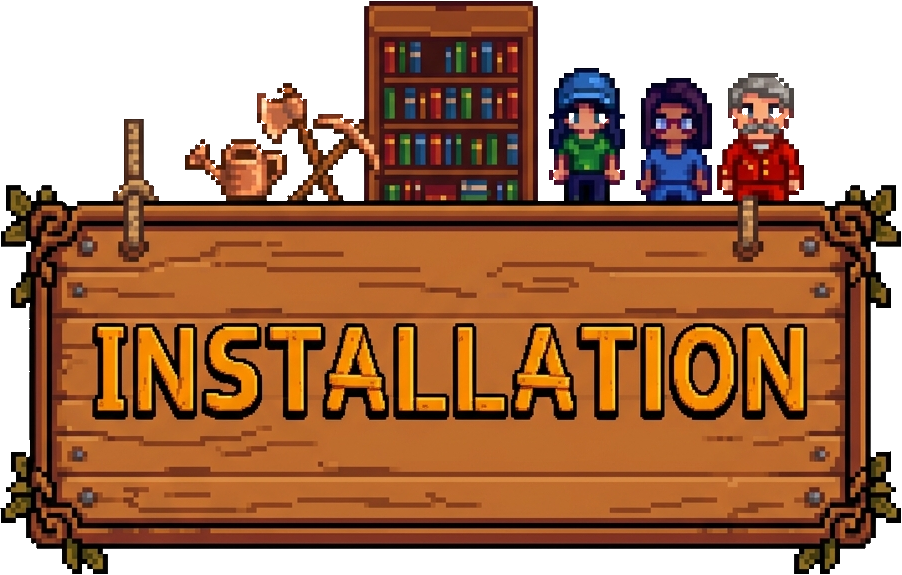

ยินดีต้อนรับสู่คอลเลกชันแพตช์ภาษาไทยสำหรับม็อดต่างๆ ของ Stardew Valley! ที่นี่มุ่งมั่นที่จะมอบเนื้อหาที่แปลแล้วเพื่อให้ผู้เล่นชาวไทยได้สนุกกับม็อดโปรดในภาษาของตัวเองครับ

  

รายชื่อม็อดที่รองรับในตอนนี้ พร้อมเครดิตผู้สร้างต้นฉบับ อย่าลืมไปดาวน์โหลดม็อดต้นฉบับและสนับสนุนผู้สร้างด้วยนะครับ!

| ชื่อม็อด | ผู้สร้าง | เวอร์ชัน | สถานะ | ลิงก์ต้นฉบับ |
| :--- | :--- | :---: | :---: | :--- |
| **[Sword & Sorcery](https://www.nexusmods.com/stardewvalley/mods/12369)** | DaisyNiko | ล่าสุด | 🔄 กำลังแปล (~41%) | [Nexus Mods](https://www.nexusmods.com/stardewvalley/mods/12369) |
| **[UI Info Suite 2 Alternative](https://www.nexusmods.com/stardewvalley/mods/43127)** | DazUki | 2.8.32 | ✅ เสร็จสมบูรณ์ | [Nexus Mods](https://www.nexusmods.com/stardewvalley/mods/43127) |
| **[Unlockable Bundles](https://www.nexusmods.com/stardewvalley/mods/17265)** | DeLiXx | 4.3.1 | ✅ เสร็จสมบูรณ์ | [Nexus Mods](https://www.nexusmods.com/stardewvalley/mods/17265) |
| **[Wear More Rings](https://www.nexusmods.com/stardewvalley/mods/3214)** | bcmpinc | 7.9 | ✅ เสร็จสมบูรณ์ | [Nexus Mods](https://www.nexusmods.com/stardewvalley/mods/3214) |
| **[World Navigator](https://www.nexusmods.com/stardewvalley/mods/28256)** | pneuma163 | 1.4.2 | ✅ เสร็จสมบูรณ์ | [Nexus Mods](https://www.nexusmods.com/stardewvalley/mods/28256) |

### 🗡️ Sword & Sorcery — ความคืบหน้าการแปล

| ตัวละคร / หมวด | สถานะ |
| :--- | :---: |
| มาเทโอ (Core, Events 0H–14H, Marriage, Custom Talk) | ✅ เสร็จแล้ว |
| เฮกเตอร์ / บิร็อก (Core, Events 0H–14H, Marriage, Custom Talk) | ✅ เสร็จแล้ว |
| เอย์วินด์ (บทสนทนา Chapter 2–4) | ✅ เสร็จแล้ว |
| ซีร์รัส (Core, เทศกาล, ของขวัญ, หนัง, รีสอร์ท) | ✅ เสร็จแล้ว |
| ซีร์รัส (Marriage, Events 0H–10H, Strings) | 🔄 กำลังแปล |
| แดนดิไลออน, รอสลิน และตัวละครที่เหลือ | ⏳ รอแปล |

  

1. ติดตั้ง [SMAPI](https://smapi.io/) และม็อดต้นฉบับตามรายการข้างบน
2. ดาวน์โหลด Release ล่าสุดของแพตช์ภาษาไทยนี้
3. แตกไฟล์แล้วนำโฟลเดอร์ `i18n` (หรือไฟล์ `.json` ที่ต้องการ) ไปวางทับในโฟลเดอร์ม็อดนั้นๆ ในไดเรกทอรี `Stardew Valley/Mods`
4. เปิดเกมแล้วตั้งค่าภาษาเป็น **ภาษาไทย (Thai)**

  

ขอขอบคุณผู้สร้างม็อดต้นฉบับทุกท่านที่ทำสิ่งเหล่านี้ขึ้นมา!
* **DaisyNiko** สำหรับ *Sword & Sorcery*
* **DazUki** สำหรับ *UI Info Suite 2 Alternative*
* **DeLiXx** สำหรับ *Unlockable Bundles*
* **bcmpinc** สำหรับ *Wear More Rings*
* **pneuma163** สำหรับ *World Navigator*

สิทธิ์และทรัพย์สินทั้งหมดของม็อดต้นฉบับเป็นของผู้สร้างแต่ละท่าน ที่นี่ให้เฉพาะไฟล์แปลภาษาเท่านั้น

## 📄 ลิขสิทธิ์

ชุดแปลภาษานี้เผยแพร่ภายใต้ MIT License อย่างไรก็ตาม กรุณาอ้างอิงสิทธิ์และลิขสิทธิ์เฉพาะของม็อดต้นฉบับแต่ละตัวด้วย ดูรายละเอียดเพิ่มเติมได้ที่ไฟล์ [LICENSE](LICENSE)
